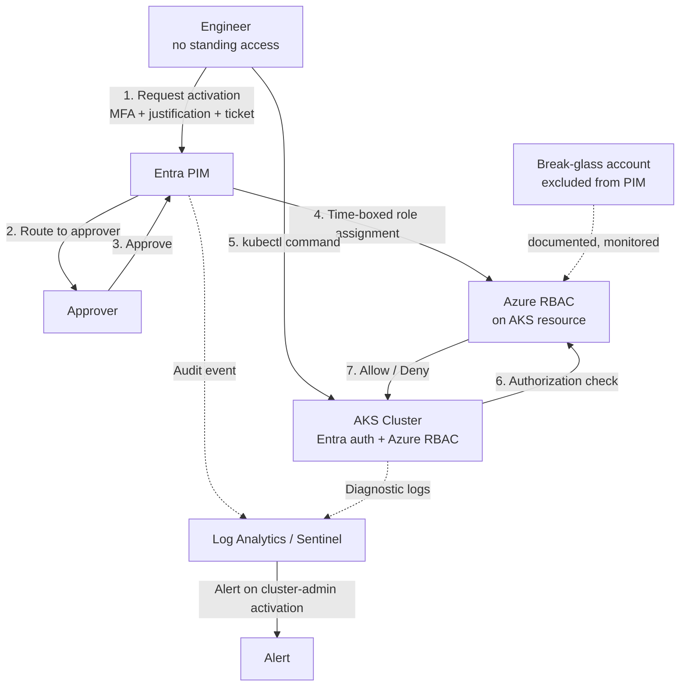
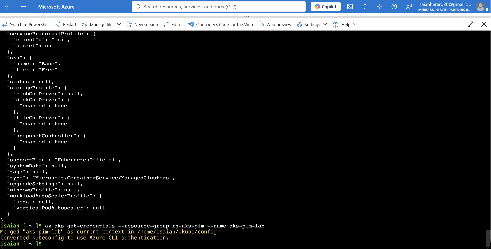
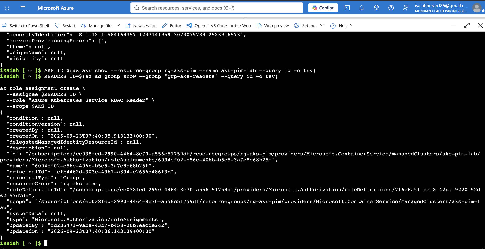
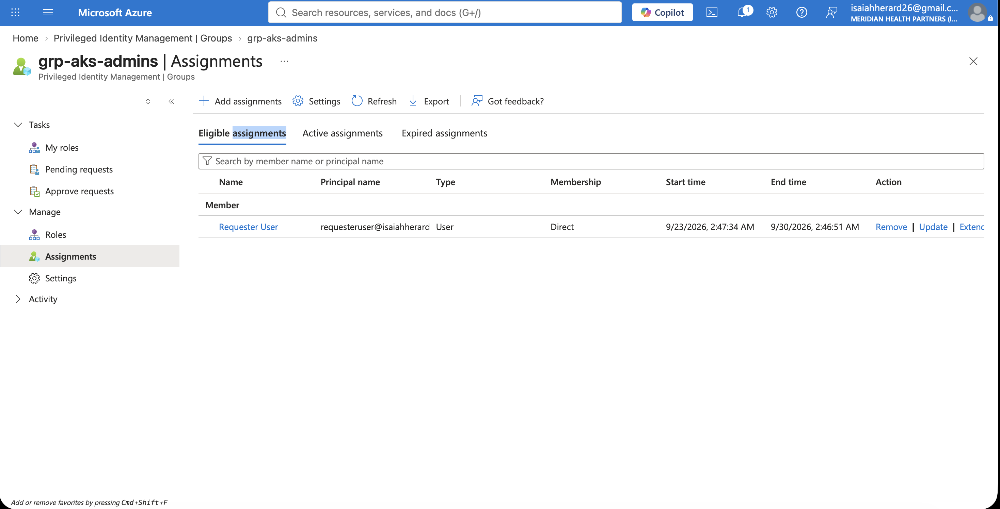
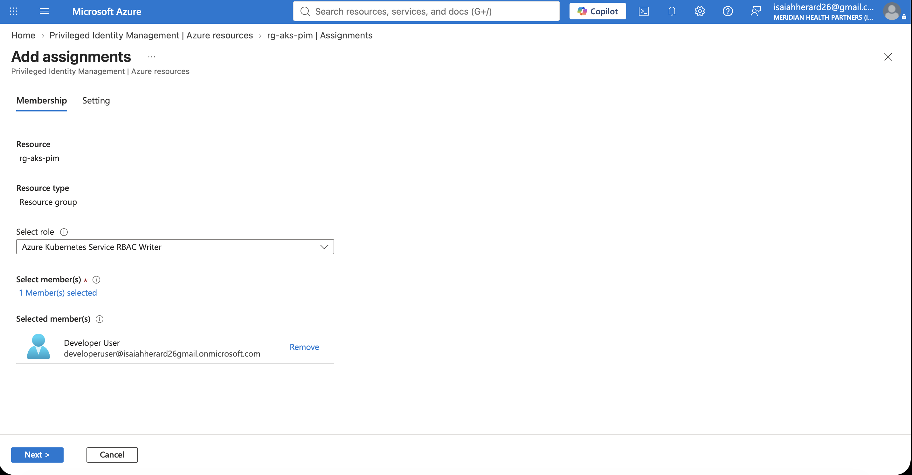
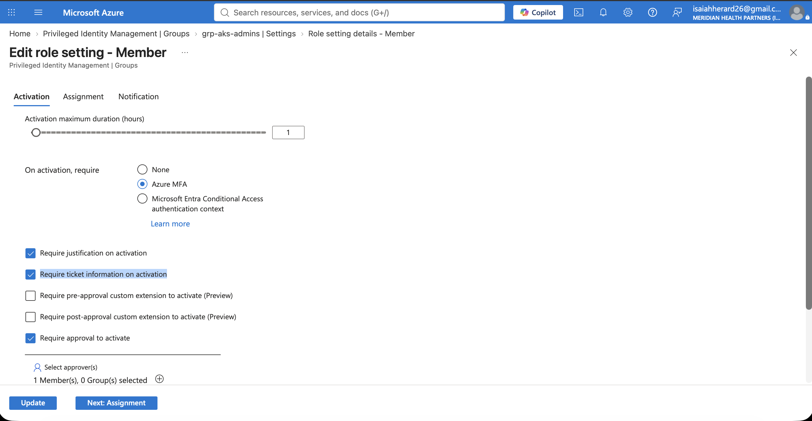
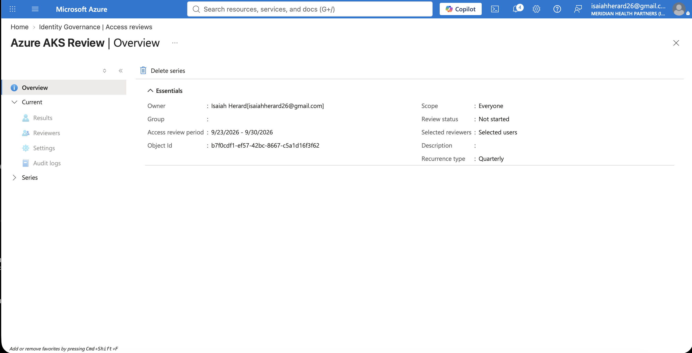
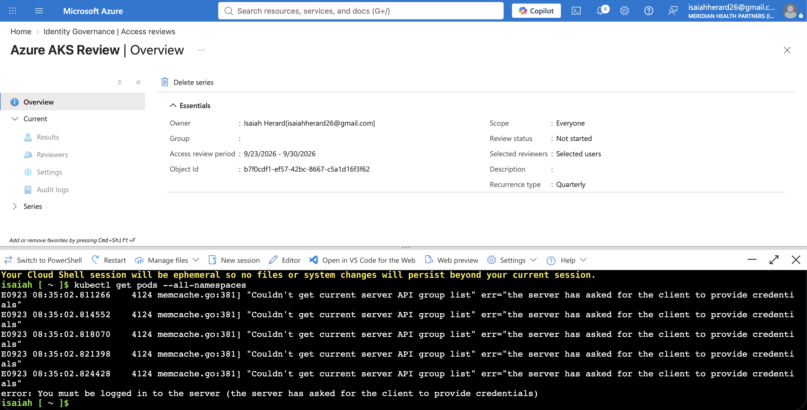
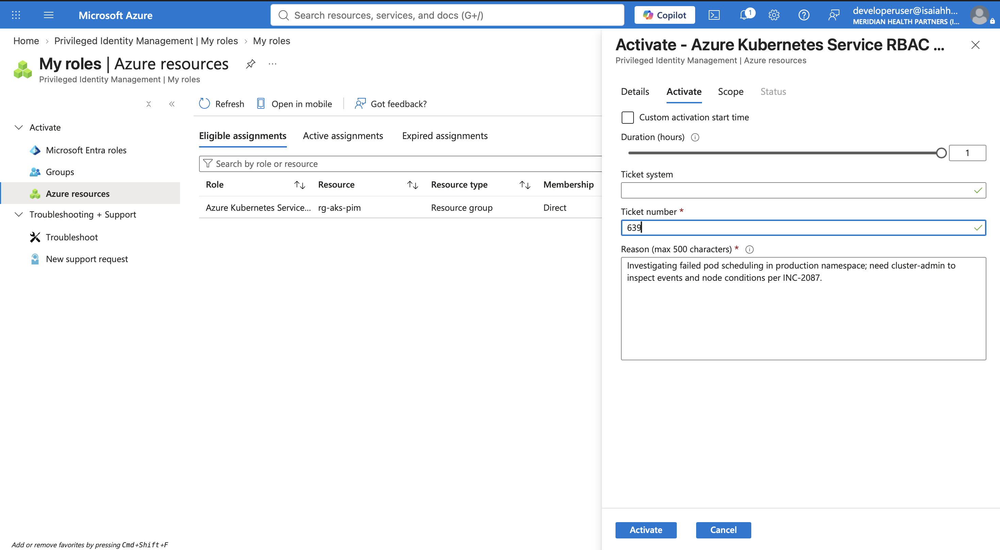
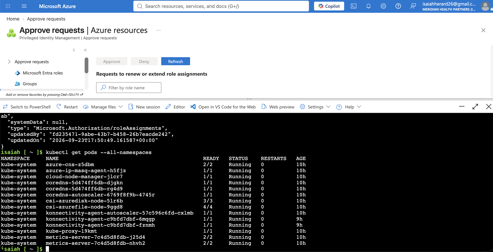

# Just-in-Time Privileged Access to AKS with Entra PIM

## Overview

This lab takes a running Azure Kubernetes Service cluster and removes standing privileged access from it. No one holds permanent `cluster-admin`. To get into the cluster, an engineer requests access for one hour, passes MFA, gives a business reason and a ticket number, and waits for an approver. The access expires on its own when the window closes. Every request is logged, and privileged activations raise an alert.

It works by delegating Kubernetes authorization to Azure RBAC, then governing the privileged role assignments with Microsoft Entra Privileged Identity Management. The outcome is a privileged-access model for a cloud-native workload that a security team can operate and an auditor can sign off on.

## The enterprise problem

Standing `cluster-admin` is the default state of most AKS deployments, and it is expensive in ways that only show up during an incident or an audit.

A cluster running native Kubernetes RBAC usually has a handful of engineers holding permanent admin. That access never gets revoked. Nothing sits between a phished laptop and full control of every workload, secret, and namespace in the cluster. There is no second factor at the moment of access, no approval, no business reason on record, and no clean trail linking a `kubectl` command to a named person. When an attacker lands on one of those accounts, the blast radius is the entire cluster.

For anyone doing an access-control review, this is a finding, not a footnote. It fails least-privilege, it fails privileged-access management, and it fails the logging and accountability expectations in ISO 27001, NIST 800-53, and PCI-DSS. The fix is not more policy documents. It is removing the standing access and making privilege something you check out and give back.

## Enterprise problems solved in this lab

| Problem in most environments | What this lab does about it | Maps to |
|------------------------------|-----------------------------|---------|
| Permanent `cluster-admin` that nobody revokes | Privileged tiers are eligible only, activated for a fixed window | Least privilege, ISO 27001 A.5.15 |
| No second factor at the point of privilege | MFA required at activation, not just at sign-in | NIST 800-53 IA-2, AC-6 |
| Admin access granted with no approval or reason | Approval, written justification, and ticket number required to activate | Separation of duties, change control |
| Access that never expires | One-hour cap, access removed automatically | Just-in-time access, NIST AC-2 |
| No trail tying a `kubectl` action to a person | Every activation captured in the Entra audit log | Accountability and logging, ISO 27001 A.8.15 |
| Eligible lists that rot as people change teams | Recurring access review recertifies who stays eligible | Periodic recertification, ISO 27001 A.5.18 |
| No detection when privilege is used | KQL alert fires on cluster-admin activations | Continuous monitoring, NIST AU-6 |
| A broken PIM service locks everyone out | Documented break-glass account, excluded and monitored | Operational resilience |

Each row below is backed by a screenshot from the actual build, so the claims are demonstrated, not asserted.

## Architecture

The decision that makes the whole model possible is `--enable-azure-rbac` on the cluster. It hands authorization decisions to Azure RBAC instead of native Kubernetes RBAC. Once that is set, controlling who can run `kubectl` is the same as controlling Azure role assignments, and Azure role assignments are what PIM governs.

*The cluster with Microsoft Entra authentication and Azure RBAC for Kubernetes authorization both enabled. This is the foundation the rest of the controls depend on.*

## Access model

Three tiers, sized to risk. Read-only stays on because it is low risk. Everything above it has to be requested.

| Tier | Azure RBAC role | Scope | Access |
|------|-----------------|-------|--------|
| Read-only | Azure Kubernetes Service RBAC Reader | Cluster | Standing |
| Namespace developer | Azure Kubernetes Service RBAC Writer | Single namespace | Eligible via PIM |
| Cluster admin | Azure Kubernetes Service RBAC Cluster Admin | Cluster | Eligible via PIM, approval required |

*The three access groups, with the read-only role assigned to the readers group at the cluster scope.*

The admin tier uses PIM for Groups. The developer tier uses PIM for Azure Resources, scoped to one namespace instead of the whole cluster. Building one of each shows both patterns and makes the tradeoff concrete: group activation is cleaner when one request should grant a bundle of access, direct resource assignment is cleaner when you want tight per-resource granularity.

*The admin user as an eligible member of the admin group. Eligible, not active. That distinction is the point of the whole project.*

*The developer tier granted as an eligible Writer assignment scoped to a single namespace. Narrow scope by design, not by default.*

## Controls enforced at activation

This is where the privileged-access control set lives. Nothing gets granted without passing all of it.

- MFA at the point of activation
- Approval routed to a designated approver
- Written business justification
- Ticket number, binding the access to a change or incident
- One-hour maximum, after which access is removed with no manual cleanup

*The activation policy: MFA, justification, ticket, approval, and the one-hour limit all enforced. This single screen is what a reviewer reads as a real PAM control set.*

## Recertification

Eligible lists go stale. People move teams and the cleanup never happens. A recurring access review is the control that stops the list from drifting into a pile of forgotten access.

*A quarterly access review over the eligible assignments, set to remove access that goes unreviewed.*

## Proof it works

Enabling a feature is not evidence. This section shows the control denying and granting access on cue, which is the difference between a portfolio piece and a screenshot of a settings page.

**Before activation,** with no active role, the command is denied:

*`kubectl get pods` refused. The user holds an eligible assignment, not an active one, so authorization fails.*

**Activation** goes through PIM with MFA, a justification, and a ticket, then an approver signs off:

*The activation request with justification and ticket, and the approval from the approver account.*

**After activation,** the same command works:

*The identical command now returns pods. Access was granted only after every control was satisfied.*

**After expiry,** access is gone again:

*Once the one-hour window closed, the command fails again. The access was genuinely temporary, with no manual revocation needed.*

**The audit trail** records who activated what, and when:

*The Entra audit log entry for the activation, tying the privileged access to a named user, a role, and a timestamp.*

## Detection

Prevention is one layer. Detection is the second. Entra audit logs and AKS diagnostics flow into a Log Analytics workspace, and a KQL query surfaces cluster-admin activations and drives an alert rule.

*A KQL query returning privileged activations, wired into a scheduled alert rule so the security team hears about cluster-admin use.*

## Break-glass

Every real PIM deployment needs an emergency account that is not subject to PIM, so an outage or a missing approver cannot lock the team out of its own cluster. This one is cloud-only, holds standing admin, is excluded from the Conditional Access that could block it, and raises an alert whenever it signs in.

*The break-glass account, documented with its exclusions and its monitoring. Most lab projects skip this. In a real environment it is the thing that saves you on the worst day.*

## Skills demonstrated

- Delegating Kubernetes authorization to Azure RBAC and understanding the tradeoff
- Designing a tiered, least-privilege access model with namespace scoping
- Operating both PIM for Groups and PIM for Azure Resources
- Building a full privileged-access control set: MFA, approval, justification, ticket binding, time-boxed expiry
- Access reviews for periodic recertification
- Detection engineering with Log Analytics, KQL, and Sentinel
- Break-glass design for operational resilience
- Mapping technical controls to ISO 27001, NIST 800-53, and PCI-DSS expectations

## Related Resources

- [AKS managed Entra integration](https://learn.microsoft.com/azure/aks/managed-azure-ad)
- [Azure RBAC for Kubernetes authorization](https://learn.microsoft.com/azure/aks/manage-azure-rbac)
- [Microsoft Entra Privileged Identity Management](https://learn.microsoft.com/entra/id-governance/privileged-identity-management/)

## Medium Article

Read the full writeup: _(link added once published)_

## Author

**Isaiah Herard**
IAM/PAM Engineer | CyberArk Specialist | Zero Trust Architect

## Conclusion

Standing privileged access is easy to hand out and hard to walk back. This lab shows the alternative in a working state: admin access to a Kubernetes cluster that has to be requested, approved, justified, and given up again, with the whole thing logged and monitored. It shrinks the attack surface without getting in the engineer's way, and it answers the exact questions an auditor and a security team bring to a privileged-access review.

Thank you.

## License

This project is licensed under the MIT License.
