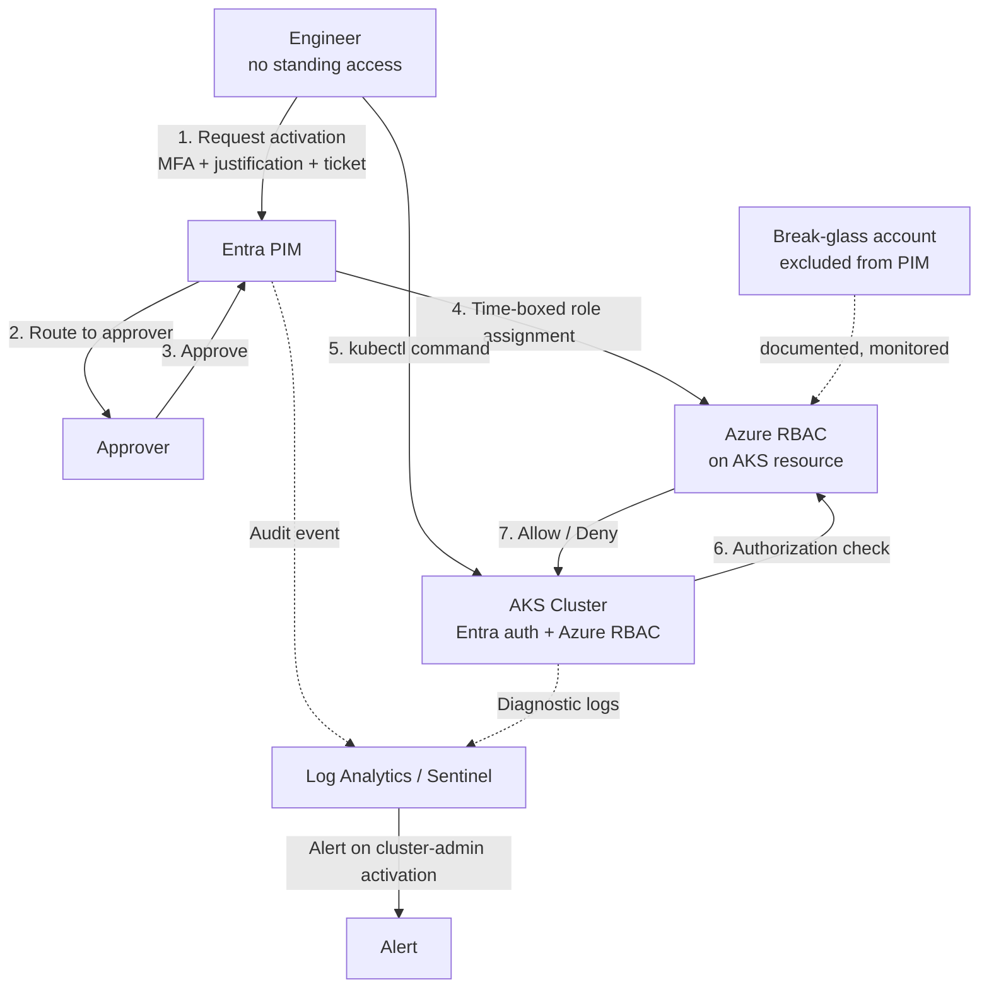

# Just-in-Time Privileged Access to AKS with Entra PIM

## Overview

This project takes a running AKS cluster and removes standing privileged access from it. No one holds permanent `cluster-admin`. To get into the cluster, an engineer requests access for a fixed window, passes MFA, gives a business reason and a ticket number, and waits for an approver. The access self-expires when the window closes. Every request is logged and can be alerted on.

The design works by delegating Kubernetes authorization to Azure RBAC, then wrapping the privileged role assignments in Microsoft Entra Privileged Identity Management. The result is a privileged-access model for a cloud-native workload that an auditor can sign off on and a security team can actually operate.

## The problem this solves

Most AKS clusters run on native Kubernetes RBAC, and the pattern is almost always the same: a handful of engineers get `cluster-admin`, that access never gets removed, and nothing sits between a compromised laptop and full control of every workload in the cluster. There is no approval, no expiry, no second factor at the moment of access, and no clean audit trail linking a `kubectl` command to a person and a reason.

That gap is exactly what gets flagged in an access-control review (ISO 27001 A.5.15 and A.5.18) and in any serious privileged-access assessment. Standing admin on production infrastructure is a finding, not a footnote.

This build closes the gap:

- Nothing above read-only is permanently assigned. Privileged tiers are eligible, not active.
- Activation requires MFA, a written justification, a ticket reference, and approval.
- Access expires on its own after one hour.
- Every activation is captured in the Entra audit log and surfaced through a KQL alert.
- A recurring access review recertifies who should still be eligible.

## Architecture

The design decision that makes all of this possible is `--enable-azure-rbac` on the cluster. It tells AKS to hand authorization decisions to Azure RBAC instead of native Kubernetes RBAC. Once that switch is flipped, controlling who can run `kubectl` is the same as controlling Azure role assignments, and Azure role assignments are what PIM governs.

## Access model

| Tier | Azure RBAC role | Scope | Access |
|------|-----------------|-------|--------|
| Read-only | Azure Kubernetes Service RBAC Reader | Cluster | Standing (low risk) |
| Namespace developer | Azure Kubernetes Service RBAC Writer | Single namespace | Eligible via PIM |
| Cluster admin | Azure Kubernetes Service RBAC Cluster Admin | Cluster | Eligible via PIM, approval required |

The developer tier is scoped to one namespace rather than the whole cluster. That is a deliberate least-privilege choice, not a default, and it is the kind of decision that separates a designed access model from a copied one.

## Two PIM patterns, on purpose

The admin tier uses **PIM for Groups**: membership in an admin group is eligible, and the group carries the Azure role. The developer tier uses **PIM for Azure Resources**: the role is assigned directly to the user as an eligible assignment on the cluster resource. Building one of each shows both patterns working and makes it clear when to reach for which. Group activation is cleaner when one request should grant a bundle of access. Direct resource assignment is cleaner when you want tight, per-resource granularity.

## Controls enforced at activation

- MFA required at the point of activation, not just at sign-in.
- Approval routed to a designated approver before access is granted.
- Written business justification required.
- Ticket number required, binding the access to a change or incident.
- One-hour maximum, after which access is gone with no manual cleanup.

## Proof it works

The project does not stop at enabling features. It demonstrates the control denying and granting access on cue:

1. With no active role, `kubectl get pods` is denied.
2. The engineer activates through PIM, completes MFA, enters a justification and ticket, and an approver signs off.
3. The same command now succeeds.
4. After the window expires, the command is denied again.
5. The activation shows up in the Entra audit log with the user, role, and timestamp.

That before, during, and after sequence is the evidence that the access is genuinely temporary and genuinely controlled.

## Beyond the core build

- **Detection.** Entra audit logs and AKS diagnostics flow into a Log Analytics workspace, with a KQL query and alert rule that fire on cluster-admin activations. Prevention plus detection, not one or the other.
- **Break-glass.** A documented emergency account, excluded from PIM and monitored on sign-in, so a PIM outage or a missing approver cannot lock the whole team out of the cluster. This is a real operational requirement, and leaving it out is how good designs fail on their worst day.

## Skills demonstrated

- Delegating Kubernetes authorization to Azure RBAC and understanding the tradeoff
- Designing a tiered, least-privilege access model with namespace scoping
- Operating both PIM for Groups and PIM for Azure Resources
- Building a complete privileged-access control set: MFA, approval, justification, ticket binding, time-boxed expiry
- Access reviews for periodic recertification
- Detection engineering with Log Analytics, KQL, and Sentinel
- Break-glass design for operational resilience

## Related Resources

- [AKS managed Entra integration](https://learn.microsoft.com/azure/aks/managed-azure-ad)
- [Azure RBAC for Kubernetes authorization](https://learn.microsoft.com/azure/aks/manage-azure-rbac)
- [Microsoft Entra Privileged Identity Management](https://learn.microsoft.com/entra/id-governance/privileged-identity-management/)

## Medium Article

Read the full writeup: _(link added once published)_

## Author

**Isaiah Herard**
IAM/PAM Engineer | CyberArk Specialist | Zero Trust Architect

## Conclusion

Standing privileged access is one of the easiest things to hand out and one of the hardest to walk back. This project shows a working alternative: privileged access to a Kubernetes cluster that has to be requested, approved, justified, and given up again, with the whole thing logged. It is the kind of control that shrinks the attack surface without slowing engineers down, and it maps directly to what auditors and security teams ask for.

Thank you.

## License

This project is licensed under the MIT License.
