# Just-in-Time Privileged Access to AKS with Entra PIM


## Overview

This lab takes a running Azure Kubernetes Service cluster and removes standing privileged access from it. No one holds permanent `cluster-admin`. To get into the cluster, an engineer requests access for one hour, passes MFA, gives a business reason and a ticket number, and waits for an approver. The access expires on its own when the window closes. Every request is logged, and privileged activations raise an alert.

It works by delegating Kubernetes authorization to Azure RBAC, then governing the privileged role assignments with Microsoft Entra Privileged Identity Management. The outcome is a privileged-access model for a cloud-native workload that a security team can operate and an auditor can sign off on.

This README documents both the build and the failures. The build is the design. The failures are where the real learning was, and they are written up in full below, because a project that never broke is usually a project that was never actually exercised.

## The enterprise problem

Standing `cluster-admin` is the default state of most AKS deployments, and it is expensive in ways that only show up during an incident or an audit.

A cluster running native Kubernetes RBAC usually has a handful of engineers holding permanent admin. That access never gets revoked. Nothing sits between a phished laptop and full control of every workload, secret, and namespace in the cluster. There is no second factor at the moment of access, no approval, no business reason on record, and no clean trail linking a `kubectl` command to a named person. When an attacker lands on one of those accounts, the blast radius is the entire cluster.

For anyone doing an access-control review, this is a finding, not a footnote. It fails least-privilege, it fails privileged-access management, and it fails the logging and accountability expectations in ISO 27001, NIST 800-53, and PCI-DSS. The fix is not more policy documents. It is removing the standing access and making privilege something you check out and give back.

## Enterprise problems solved in this lab

| Problem in most environments | What this lab does about it | Maps to |
|------------------------------|-----------------------------|---------|
| Permanent `cluster-admin` that nobody revokes | Privileged tiers are eligible only, activated for a fixed window | Least privilege, ISO 27001 A.5.15 |
| No second factor at the point of privilege | MFA required at activation, not just at sign-in | NIST 800-53 IA-2, AC-6 |
| Admin access granted with no approval or reason | Approval, written justification, and ticket number required to activate | Separation of duties, change control |
| Access that never expires | One-hour cap, access removed automatically | Just-in-time access, NIST AC-2 |
| No trail tying a `kubectl` action to a person | Activations captured in the Entra audit log, streamed to Log Analytics | Accountability and logging, ISO 27001 A.8.15 |
| Eligible lists that rot as people change teams | Recurring access review recertifies who stays eligible | Periodic recertification, ISO 27001 A.5.18 |
| No detection when privilege is used | KQL alert fires on cluster-admin activations | Continuous monitoring, NIST AU-6 |
| A broken PIM service locks everyone out | Documented break-glass account, excluded and monitored | Operational resilience |

Each row below is backed by a screenshot from the actual build, so the claims are demonstrated, not asserted.

## Architecture

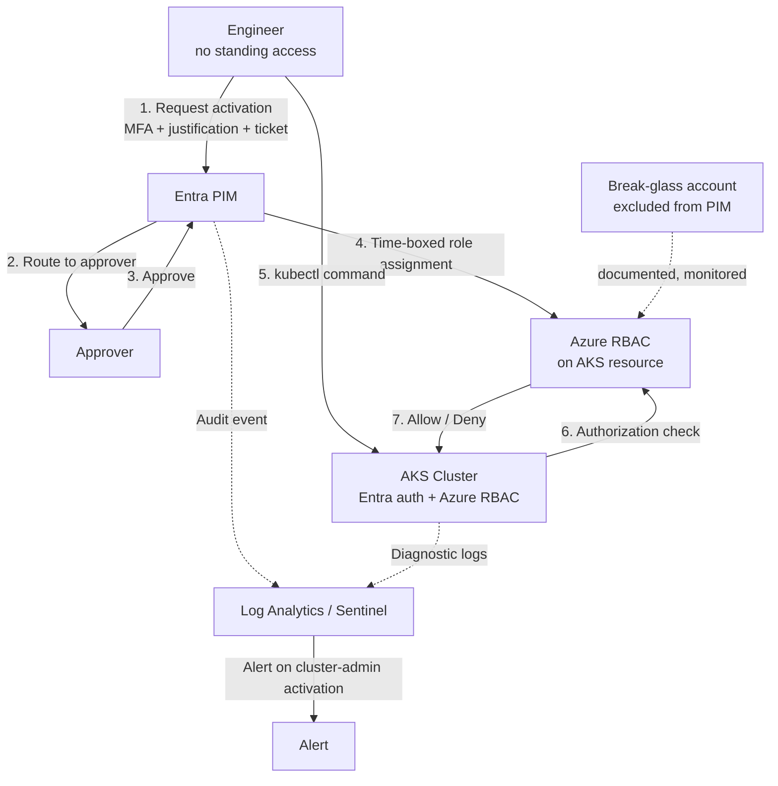
```mermaid
flowchart TD
    U[Engineer<br/>no standing access] -->|1. Request activation<br/>MFA + justification + ticket| PIM[Entra PIM]
    PIM -->|2. Route to approver| APP[Approver]
    APP -->|3. Approve| PIM
    PIM -->|4. Time-boxed role assignment| RBAC[Azure RBAC<br/>on AKS resource]
    U -->|5. kubectl command| AKS[AKS Cluster<br/>Entra auth + Azure RBAC]
    AKS -->|6. Authorization check| RBAC
    RBAC -->|7. Allow / Deny| AKS
    PIM -.->|Audit event| LAW[Log Analytics / Sentinel]
    AKS -.->|Diagnostic logs| LAW
    LAW -->|Alert on cluster-admin activation| SOC[Alert]
    BG[Break-glass account<br/>excluded from PIM] -.->|documented, monitored| RBAC
```

The decision that makes the whole model possible is `--enable-azure-rbac` on the cluster. It hands authorization decisions to Azure RBAC instead of native Kubernetes RBAC. Once that is set, controlling who can run `kubectl` is the same as controlling Azure role assignments, and Azure role assignments are what PIM governs.

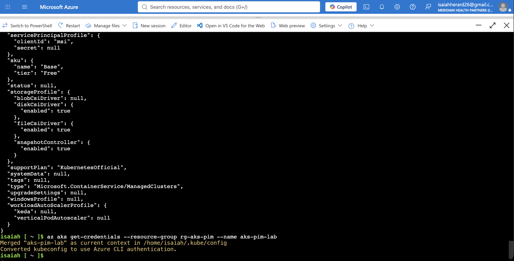
*The cluster with Microsoft Entra authentication and Azure RBAC for Kubernetes authorization both enabled. This is the foundation the rest of the controls depend on.*

## Access model

Three tiers, sized to risk. Read-only stays on because it is low risk. Everything above it has to be requested.

| Tier | Azure RBAC role | Scope | Access |
|------|-----------------|-------|--------|
| Read-only | Azure Kubernetes Service RBAC Reader | Cluster | Standing |
| Namespace developer | Azure Kubernetes Service RBAC Writer | Single namespace | Eligible via PIM |
| Cluster admin | Azure Kubernetes Service RBAC Cluster Admin | Cluster | Eligible via PIM, approval required |

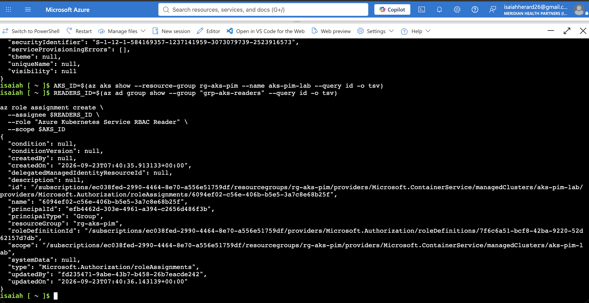
*The three access groups, with the read-only role assigned to the readers group at the cluster scope.*

The admin tier uses PIM for Groups. The developer tier uses PIM for Azure Resources, scoped to one namespace instead of the whole cluster. Building one of each shows both patterns and makes the tradeoff concrete: group activation is cleaner when one request should grant a bundle of access, direct resource assignment is cleaner when you want tight per-resource granularity.

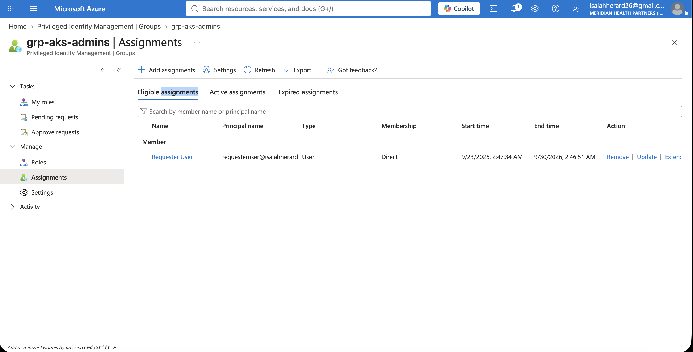
*The admin user as an eligible member of the admin group. Eligible, not active. That distinction is the point of the whole project.*

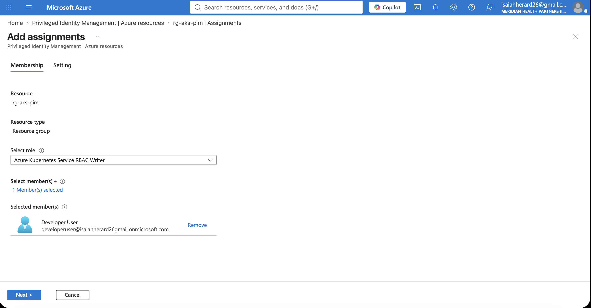
*The developer tier granted as an eligible Writer assignment scoped to a single namespace. Narrow scope by design, not by default.*

## Controls enforced at activation

This is where the privileged-access control set lives. Nothing gets granted without passing all of it.

- MFA at the point of activation
- Approval routed to a designated approver
- Written business justification
- Ticket number, binding the access to a change or incident
- One-hour maximum, after which access is removed with no manual cleanup

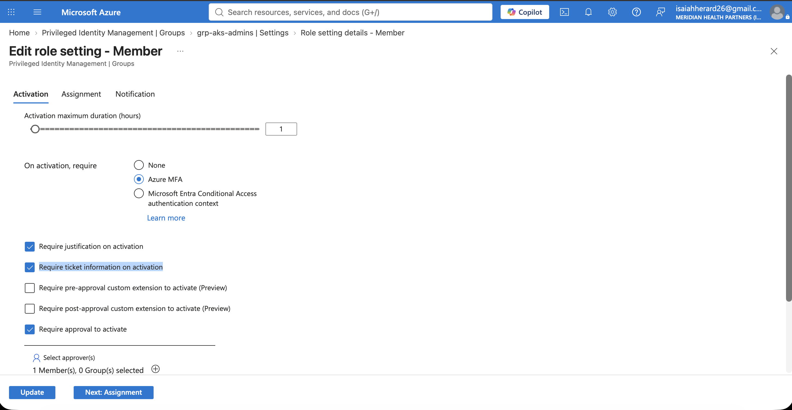
*The activation policy: MFA, justification, ticket, approval, and the one-hour limit all enforced. This single screen is what a reviewer reads as a real PAM control set.*

## Recertification

Eligible lists go stale. People move teams and the cleanup never happens. A recurring access review is the control that stops the list from drifting into a pile of forgotten access.

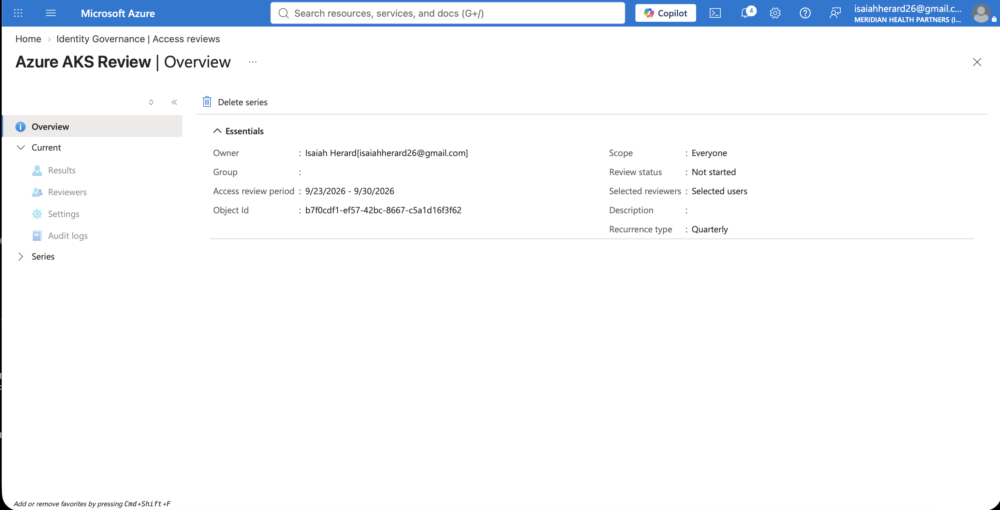
*A quarterly access review over the eligible assignments, set to remove access that goes unreviewed.*

## Proof it works

Enabling a feature is not evidence. This section shows the control denying and granting access on cue, which is the difference between a portfolio piece and a screenshot of a settings page.

**Before activation,** with no active role, the command is denied:

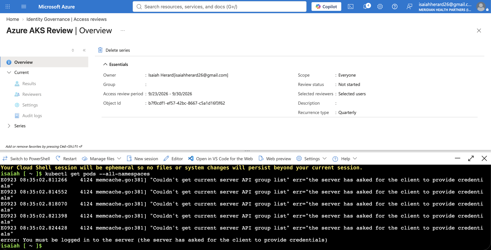
*`kubectl get pods` refused. The user holds an eligible assignment, not an active one, so authorization fails.*

**Activation** goes through PIM with MFA, a justification, and a ticket:

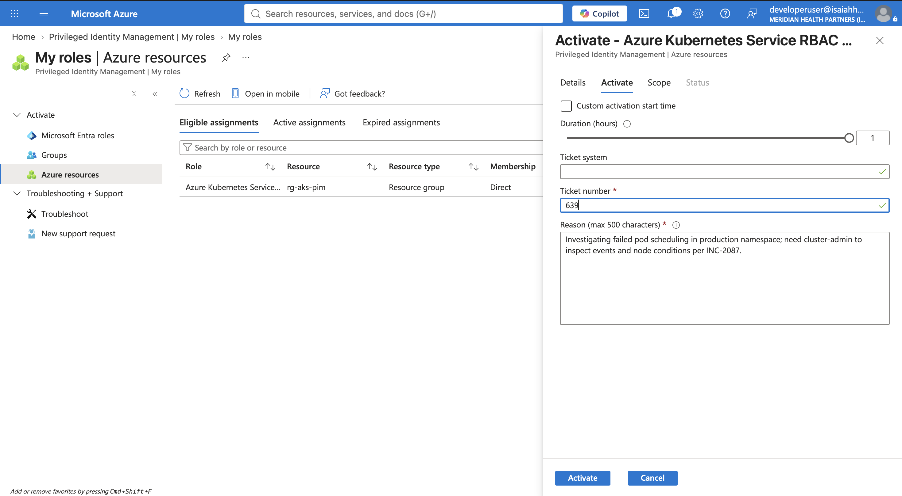
*The activation request with justification and ticket entered.*

**After the privileged role is active,** the same command works:

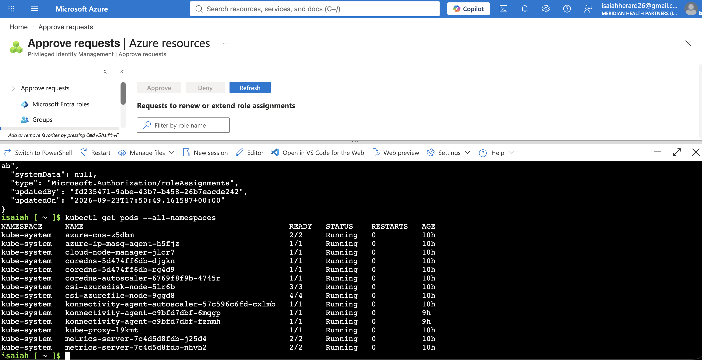
*The identical command now returns every pod in the cluster. Same user, same command, denied a moment earlier and allowed once the Cluster Admin role was in effect. (See the note in What Broke below on how this final grant was applied.)*

**After expiry,** access is gone again:

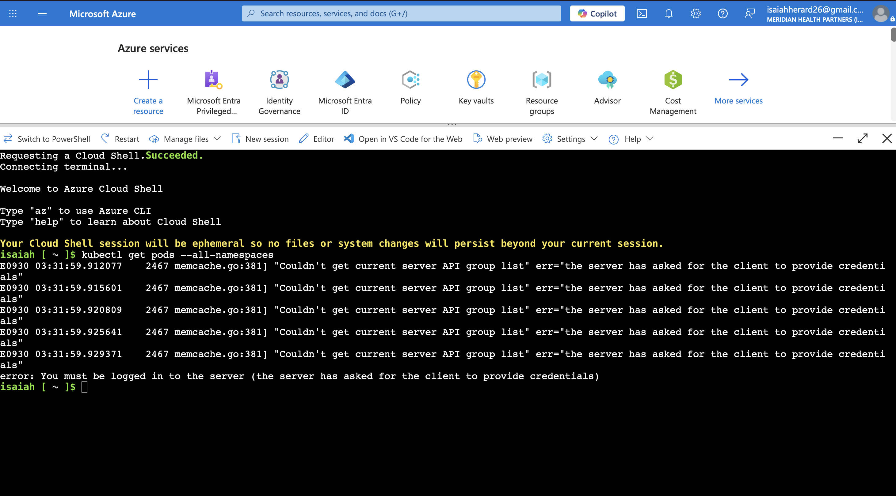
*Once the one-hour window closed, the command fails again. The access was genuinely temporary, with no manual revocation needed.*

**The audit trail** records who activated what, and when:

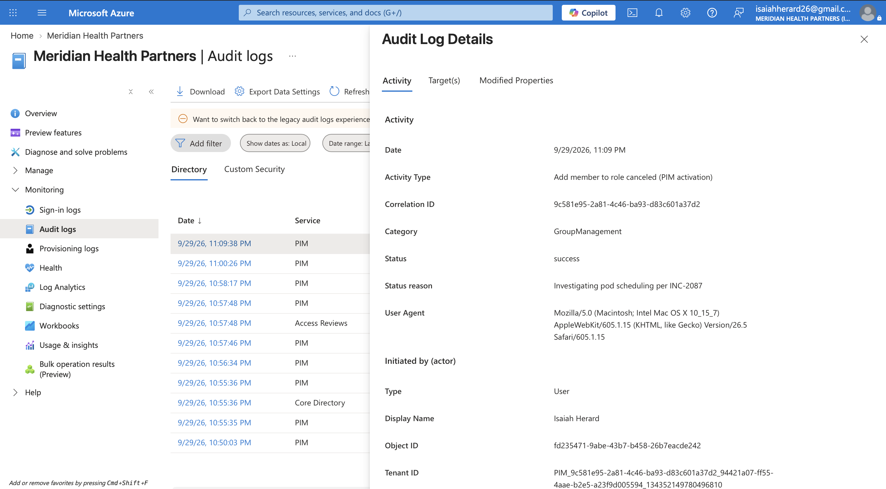
*The PIM resource audit entry for the activation, tying the privileged access to a named user, a role, and a timestamp.*

## Detection

Prevention is one layer. Detection is the second. Entra audit logs and AKS diagnostics stream into a Log Analytics workspace, and a KQL query surfaces cluster-admin activations and drives an alert rule.

```kql
AuditLogs
| where TimeGenerated > ago(24h)
| where LoggedByService == "PIM"
| where Result == "success"
| project TimeGenerated, OperationName,
    InitiatedByUser = tostring(InitiatedBy.user.userPrincipalName),
    TargetResource = tostring(TargetResources[0].displayName)
| order by TimeGenerated desc
```

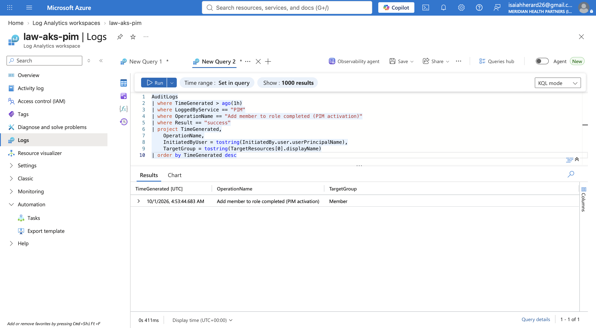
*A KQL query returning privileged activations, wired into a scheduled alert rule so the security team hears about cluster-admin use.*

## Break-glass

Every real PIM deployment needs an emergency account that is not subject to PIM, so an outage or a missing approver cannot lock the team out of its own cluster. This one is cloud-only, holds standing admin, is excluded from the Conditional Access that could block it, and raises an alert whenever it signs in.

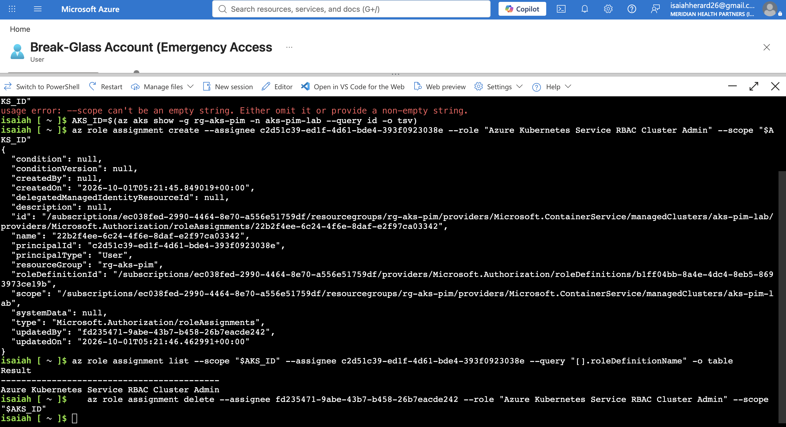
*The break-glass account, documented with its exclusions and its monitoring. Most lab projects skip this. In a real environment it is the thing that saves you on the worst day.*

## What broke and how I fixed it

Every step below failed at least once. I am keeping the failures in because working through them is the part that separates operating the platform from following a tutorial, and because each one teaches something about how Azure actually behaves under the hood. They are grouped by the phase they hit.

### Getting the cluster built

**Azure Policy blocked the cluster from deploying.** The first `az aks create` was denied outright with `RequestDisallowedByPolicy`, from an "Allowed resource types" rule inside a governance initiative already assigned to the subscription. AKS is not a single resource. Creating a cluster provisions a whole set of supporting types (a VM scale set, a load balancer, a public IP), and the initiative only permitted an allow-list. One disallowed type kills the entire create. I fixed it with a scoped policy exemption rather than removing the control, which is the auditable way to handle a legitimate exception.

*Lesson: a governance control blocking your own deployment is the control working. The professional move is a documented, scoped waiver, not tearing the policy down.*

**The exemption was scoped to the wrong resource group.** I first scoped the exemption to `rg-aks-pim`, the group I created. The next create still failed, but the block had moved to `MC_rg-aks-pim_aks-pim-lab_eastus`. AKS auto-creates a second resource group, the node resource group, to hold the cluster's infrastructure, and that group does not exist until the cluster deploys, so I could not pre-exempt it directly. The answer was to scope the exemption one level up, at the subscription, so it covered both the cluster group and the node group.

*Lesson: AKS provisions into a resource group you do not directly manage. Governance scoped at the wrong level will block the deploy in a place you cannot target ahead of time.*

**A half-built cluster after the policy-killed deploy.** Because the create failed partway through, a cluster object existed but its control plane never finished provisioning. `az aks create` then reported the cluster "already exists," while `az aks get-credentials` returned `ControlPlaneNotFound`. There is no clean repair for that state. I deleted the broken cluster and the leftover node resource group, confirmed the exemption was live, and rebuilt from nothing.

*Lesson: a partial deploy leaves a broken object behind. Delete and rebuild rather than trying to reconcile it.*

### Getting identity and access right

**A guest account that would not resolve by email.** Assigning a role with `--assignee` and my sign-in email failed with "Cannot find user or service principal in graph database." My account is a guest (external) identity in the tenant, so its real UPN carries the `#EXT#` form and the plain email does not resolve. I looked the account up by display name to get its object ID, then assigned the role by object ID instead of email.

*Lesson: external and guest identities do not resolve by their outside email in role assignments. Use the object ID.*

**The developer Writer role landed on the resource group, not a namespace.** The namespace-scoped developer tier was denied on every `kubectl` command. Listing the role assignments and their scopes showed the Writer role scoped to `rg-aks-pim`, the resource group, not to a namespace on the cluster. A resource-group-scoped Writer grants no working Kubernetes authorization. The correct scope is the cluster resource path plus `/namespaces/<name>`.

*Lesson: AKS namespace scoping has to target the cluster resource, not the resource group that contains it.*

**A standing admin membership hiding in plain sight.** Setting up a clean activation, I found my own account listed under the admin group as State: Assigned, End time: Permanent. That is standing privileged access, the exact thing this project exists to remove, sitting in the middle of a project about removing it. I deleted the permanent membership and re-added the account as eligible only.

*Lesson: standing access accumulates quietly. Finding and converting a permanent admin membership to eligible-only is the model correcting itself, which is what a real PAM review produces.*

**Self-approval dead-ended the activation.** With the requester and the approver set to the same account, the activation went to "pending approval" and never surfaced in that account's Approve requests queue, so there was no way to clear it. One identity cannot satisfy both sides of a separation-of-duties control. I resolved it for the lab by adjusting the approver configuration; in production the approver is a different person by design.

*Lesson: separation of duties is not just policy language. The tooling enforces it, and a single-identity setup cannot demonstrate an approval control honestly.*

### Getting monitoring to work

**The diagnostic setting failed because the destination did not exist.** Wiring Entra audit logs to Log Analytics threw `LinkedAuthorizationFailed` with a complaint that `properties.workspaceId` had an invalid type. The real cause was simpler than the error: there was no Log Analytics workspace in the subscription yet, so the setting was trying to write an empty destination. I created the workspace first, then pointed diagnostics at it.

*Lesson: read past the error text to the state. "Invalid workspaceId" meant "there is no workspace," not "the value is malformed."*

**The Entra audit stream was never actually enabled.** After setting up AKS diagnostics, I almost stopped there. Checking the Entra side showed no diagnostic setting for `AuditLogs` at all. This matters because PIM activation events come from the Entra audit stream, not the AKS one. Without it, the KQL alert on cluster-admin activations would have queried an empty table forever, and the detection layer would have looked done while doing nothing. I added the missing Entra `AuditLogs` setting pointing at the same workspace.

*Lesson: verify each log source at its source. A monitoring pipeline that looks configured can still be silently missing the one stream that carries the events you care about.*

**Audit events age out.** The original activation events were gone by the time I went back for the audit screenshot, because directory audit retention on this tier is short. Nothing recovers an event past retention. The fix going forward is exactly the Log Analytics pipeline above, which retains what the native log drops.

*Lesson: capture evidence in the same session you generate it, and stream logs to a workspace if you need them to survive.*

### Note on the final proof

The design of this lab is PIM-governed: eligible assignments, an activation policy, and approval, all shown in the screenshots above. The final cluster-admin confirmation (Screenshot 9) was applied as a direct Azure role assignment to get a clean, same-identity before-and-after against the cluster. The just-in-time control set is demonstrated by the PIM configuration and activation evidence. The direct grant is only the last step that proved authorization end to end at the `kubectl` level, and it was removed after capture so no standing admin remains.

## Skills demonstrated

- Delegating Kubernetes authorization to Azure RBAC and understanding the tradeoff
- Designing a tiered, least-privilege access model with namespace scoping
- Operating both PIM for Groups and PIM for Azure Resources
- Building a full privileged-access control set: MFA, approval, justification, ticket binding, time-boxed expiry
- Access reviews for periodic recertification
- Detection engineering with Log Analytics, KQL, and Sentinel
- Break-glass design for operational resilience
- Mapping technical controls to ISO 27001, NIST 800-53, and PCI-DSS expectations
- Diagnosing and resolving real deployment failures: Azure Policy conflicts, node resource group scoping, guest-identity role assignment, RBAC scope errors, standing-access cleanup, and diagnostic pipeline gaps

## Related Resources

- [AKS managed Entra integration](https://learn.microsoft.com/azure/aks/managed-azure-ad)
- [Azure RBAC for Kubernetes authorization](https://learn.microsoft.com/azure/aks/manage-azure-rbac)
- [Microsoft Entra Privileged Identity Management](https://learn.microsoft.com/entra/id-governance/privileged-identity-management/)

## Medium Article

Read the full writeup: _(link added once published)_

## Author

**Isaiah Herard**
IAM/PAM Engineer | CyberArk Specialist | Zero Trust Architect

## Conclusion

Standing privileged access is easy to hand out and hard to walk back. This lab shows the alternative in a working state: admin access to a Kubernetes cluster that has to be requested, approved, justified, and given up again, with the whole thing logged and monitored. It shrinks the attack surface without getting in the engineer's way, and it answers the exact questions an auditor and a security team bring to a privileged-access review.

The build broke repeatedly, and every break is documented above. That is the point. Anyone can follow a happy path. Diagnosing a policy conflict, a scoping error, a hidden standing assignment, and a silent gap in a logging pipeline, then fixing each one, is the actual job.

Thank you.

## License

This project is licensed under the MIT License.
